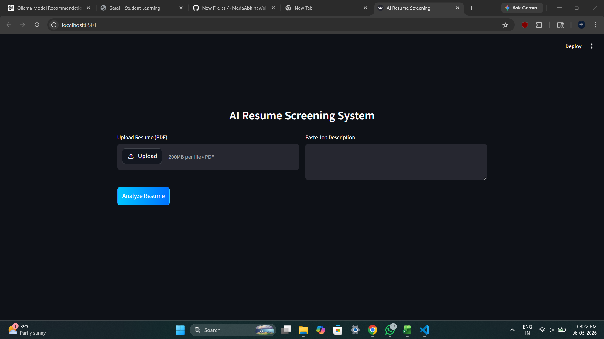
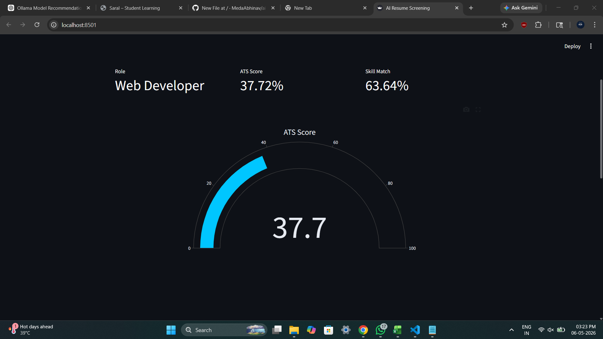
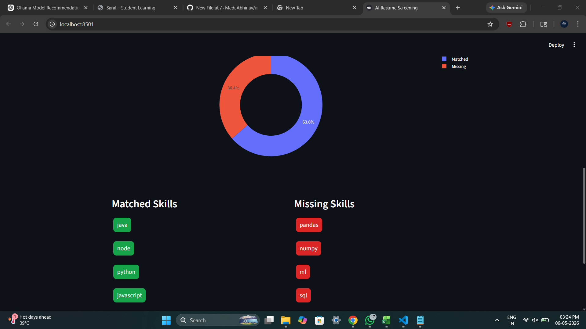

# AI Resume Screening System

AI-powered Resume Screening System built using Machine Learning and NLP to automate candidate evaluation and ATS-based resume analysis.

## Key Features

- Predicts candidate job roles using Machine Learning
- Calculates ATS score based on resume quality and JD relevance
- Performs intelligent skill matching analysis
- Compares resumes with job descriptions using NLP similarity
- Interactive dashboard with real-time analytics and visualizations
- Supports PDF resume parsing and automated text extraction
- Modern responsive UI built with Streamlit and Plotly

## Tech Stack

- Python
- Streamlit
- Scikit-learn
- NLP
- Plotly
- PyPDF2
- Joblib

## Screenshots

### Dashboard


### ATS Score Analysis


### Skill Matching


## Installation

```bash
git clone https://github.com/yourusername/ai-resume-screening-system.git

cd ai-resume-screening-system

pip install -r requirements.txt

streamlit run app.py
```

## Future Improvements

- Semantic AI-based resume matching
- Resume recommendation engine
- Experience-based candidate ranking
- Cloud deployment support
- AI career assistant integration

